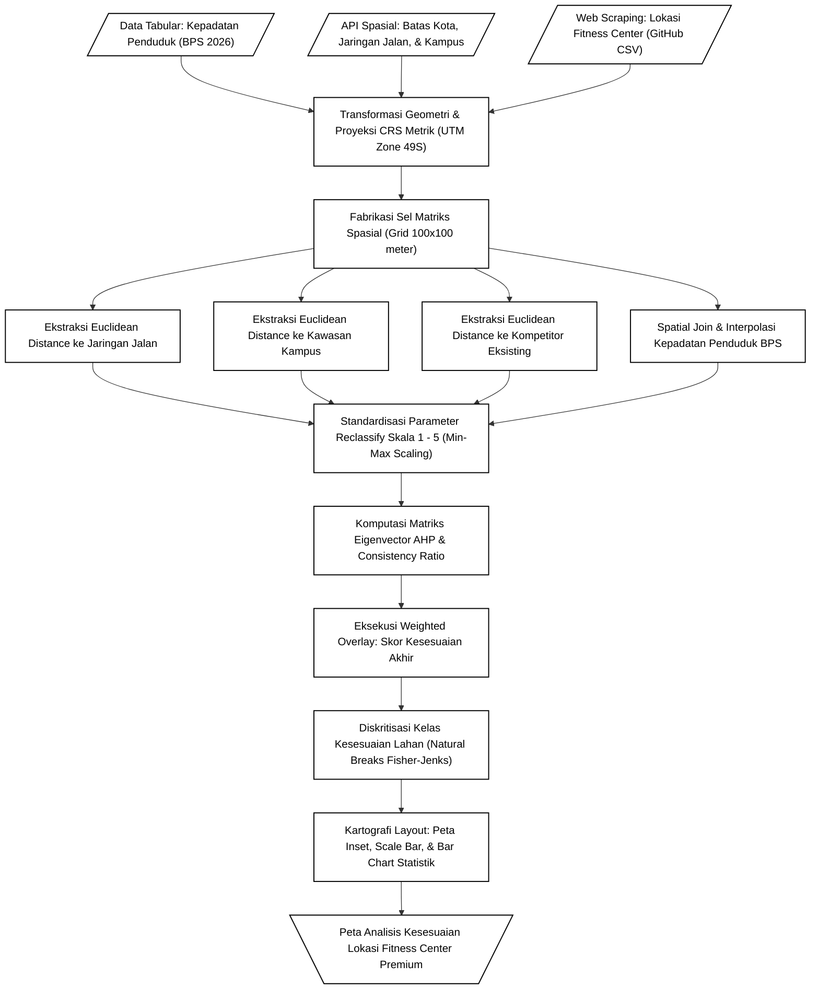

# 🌍 Analisis Kesesuaian Lokasi Fitness Center Berdasarkan Aksesibilitas dan Kepadatan Penduduk Usia Produktif
**Studi Kasus:** Kawasan Perkotaan Yogyakarta, Daerah Istimewa Yogyakarta Tahun 2026


[](https://colab.research.google.com/github/Clis3n/23-517152-SV-22742_Clisen-Ardy-Laksono-Wicaksono_GitHub/blob/main/23-517152-SV-22742_Clisen-Ardy-Laksono-Wicaksono_Kode.ipynb)

*(Klik lencana di atas untuk mereproduksi seluruh alur komputasi spasial secara instan melalui cloud)*

---

## 📌 Deskripsi Eksekutif
Repositori ini mengimplementasikan purwarupa sistem pendukung keputusan geospasial berbasis **Multi-Criteria Decision Analysis (MCDA)**. Sistem dirancang secara otonom untuk menetapkan klaster lahan (*site selection*) paling optimal bagi pendirian fasilitas *fitness center* premium di kawasan perkotaan yang padat. Proyek ini dikembangkan sebagai luaran Tugas Akhir Praktikum Aplikasi SIG untuk Sosial, Ekonomi, dan Bisnis (SVIG223647) di Program Studi Sistem Informasi Geografis, Universitas Gadjah Mada (UGM).

Sistem ini dibangun dengan arsitektur **Fully Reproducible Research**. Kecuali repositori hasil *scraping*, seluruh parameter evaluasi keruangan diekstraksi secara *live* dari infrastruktur *Open Source*, memitigasi kebutuhan penyimpanan *shapefile* statis secara lokal yang membebani memori.

---

## ⚙️ Metodologi & Arsitektur Sistem

Analisis dieksekusi dengan memecah area Kota Yogyakarta menjadi unit matriks seluler beresolusi tinggi (Grid $100 \times 100$ meter) yang diproyeksikan pada koordinat metrik absolut **UTM Zone 49S (EPSG:32749)**. 

Algoritma mengadopsi model **Analytic Hierarchy Process (AHP)** (Saaty, 1980) untuk mendekonstruksi prioritas kriteria melalui proses evaluasi matriks berbasis *Numpy Eigenvector*, diikuti operasi *Weighted Overlay*.

### Diagram Alir Komputasi (Workflow)


---

## 🗂️ Kamus Data (Parameter Evaluasi)

| Kriteria Spasial | Sifat Parameter | Representasi Logistik / Bisnis | Sumber Data | Bobot AHP |
| :--- | :---: | :--- | :--- | :---: |
| **Jaringan Jalan** | *Benefit* | Kemudahan aksesibilitas transportasi pelanggan (Jalan Arteri/Kolektor) | OpenStreetMap (OSMnx) | **35.1%** |
| **Kawasan Pendidikan** | *Benefit* | Proksi kedekatan terhadap sentra pasar usia produktif (Universitas) | OpenStreetMap (OSMnx) | **35.1%** |
| **Kepadatan Demografi** | *Benefit* | Kuantitas populasi absolut per Km² tingkat kecamatan | BPS Kota Yogyakarta (2026) | **18.9%** |
| **Jarak Kompetitor** | *Cost* | Mitigasi area persaingan jenuh (*Market saturation avoidance*) | Google Maps (*Web Scraping*) | **10.9%** |

*(Catatan: Pengujian matriks menghasilkan Rasio Konsistensi (CR) sebesar 0.0018, membuktikan validitas model < 0.1)*

---

## 🚀 Fitur Utama (*Highlight*)
1. **Zero-Dependency Local Data:** Tidak ada file vektor `.shp` yang diwajibkan. Kode menarik data infrastruktur perkotaan secara *live* melalui *Overpass API*.
2. **One-Click Cloud Execution:** Kompatibel 100% dengan lingkungan isolasi Google Colab, lengkap dengan mekanisme perlindungan dependensi spasial otomatis (`pip install` fallback).
3. **Publication-Ready Cartography:** Modul memproduksi *Dashboard Layout* secara terprogram (*programmatic layouting* via `matplotlib.gridspec`), mencakup algoritma *Label-Repel* (`adjustText`), Skala metrik, Arah Utara Poligonal, Inset Peta Regional, dan *Bar Chart* distribusi lahan. Ekspor dieksekusi otomatis pada resolusi cetak **300 dpi**.

---

## 🛠️ Instalasi dan Eksekusi Lokal
Jika bermaksud mereproduksi proyek ini di lingkungan komputer lokal (VS Code / Jupyter Notebook), replikasikan lingkungan virtual dengan perintah berikut:

```bash
# Instalasi dependensi
pip install -r requirements.txt
```

Eksekusi keseluruhan *notebook*: `23-517152-SV-22742_ClisenArdyLaksonoWicaksono_Kode.ipynb`. 
*Output* tata letak peta final akan dirender secara langsung dan diekspor ke dalam direktori `output/`.

---
**Dibuat oleh:**  
**Clisen Ardy Laksono Wicaksono** (NIM: 23/517152/SV/22742)  
Program Studi Sarjana Terapan Sistem Informasi Geografis  
Universitas Gadjah Mada - 2026
